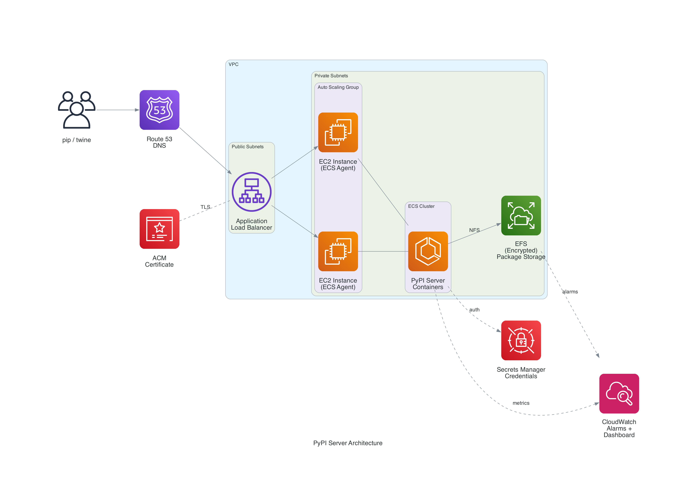

# terraform-aws-pypiserver

A production-ready Terraform module for deploying a private
[PyPI server](https://github.com/pypiserver/pypiserver)
on AWS with high availability, encryption, automated backups, and monitoring.

## Features

- **High Availability**: Auto-scaling ECS cluster across multiple availability zones
- **Encryption at Rest**: EFS storage encrypted with AWS KMS
- **Encryption in Transit**: HTTPS with auto-provisioned ACM certificates
- **Authentication**: HTTP Basic Auth with credentials stored in AWS Secrets Manager
- **Automated Backups**: Configurable AWS Backup for EFS with retention policies
- **Monitoring**: CloudWatch alarms and dashboard for EFS, ECS, and ALB metrics
- **Cost Optimization**: EFS lifecycle policies to move old packages to Infrequent Access
- **Auto-Calculation**: Task counts and resource allocation derived from instance type

## Quick Start

```hcl
module "pypiserver" {
  source  = "registry.infrahouse.com/infrahouse/pypiserver/aws"
  version = "2.2.0"

  providers = {
    aws     = aws
    aws.dns = aws
  }

  asg_subnets           = ["subnet-private-1a", "subnet-private-1b"]
  load_balancer_subnets = ["subnet-public-1a", "subnet-public-1b"]
  zone_id               = "Z1234567890ABC"
  alarm_emails          = ["ops@example.com"]
}
```

See [Getting Started](getting-started.md) for a complete walkthrough.

## Architecture



## How It Works

The module deploys [pypiserver](https://github.com/pypiserver/pypiserver) as Docker
containers on ECS with an Application Load Balancer for HTTPS termination and an
encrypted EFS volume for shared package storage. All containers share the same EFS
mount, so packages uploaded to any container are immediately available from all others.

The module uses `--backend simple-dir` (no caching) to avoid cache synchronization
issues across distributed gunicorn workers. This trades some per-request performance
for guaranteed consistency. See [Architecture](architecture.md) for details.

## Documentation

- [Getting Started](getting-started.md) -- Prerequisites and first deployment
- [Architecture](architecture.md) -- How the components fit together
- [Configuration](configuration.md) -- All variables explained with examples
- [Examples](examples.md) -- Common deployment scenarios
- [Sizing](SIZING.md) -- Capacity planning and cost estimates
- [Troubleshooting](troubleshooting.md) -- Common issues and solutions
